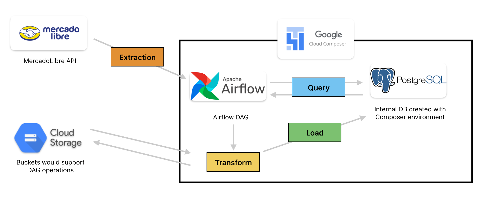
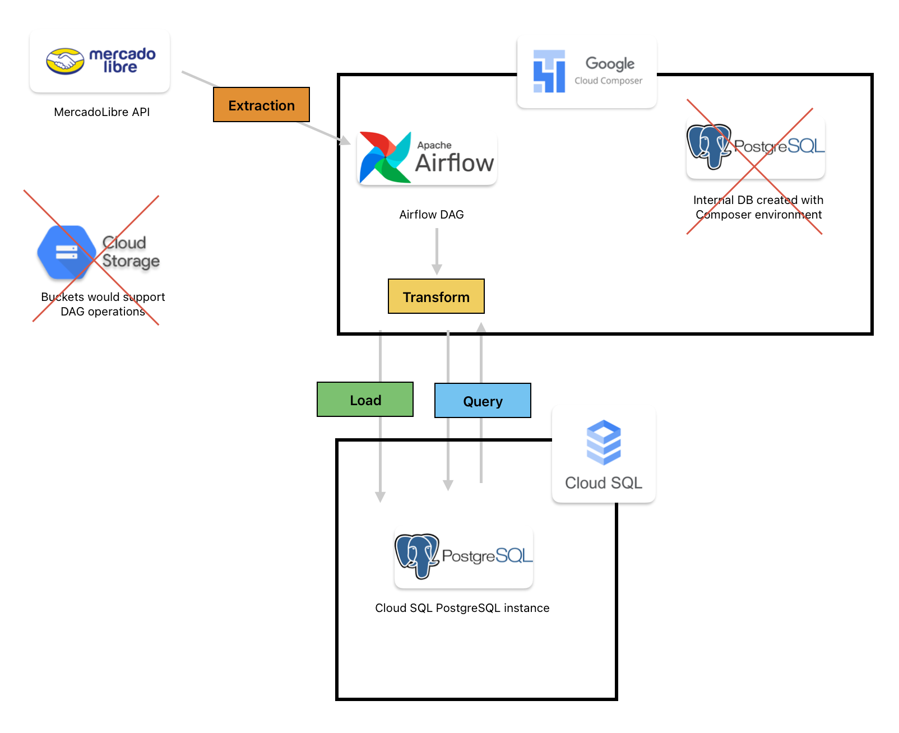

# Eclypsium Data Engineering Challenge

These are notes documenting my experience with this challenge, I want to explain all the design choices I made and the problems I bumped into while trying to write the Airflow DAG.

## I. Stack and Design

For Airflow, a local development environment with Docker seemed too complicated to set up, there are always little errors that would have take too much time to fix, so I decided to go full cloud for the challenge. Here's the initial stack idea I had using Google Cloud Platform.

As you can see, the data would be extracted from the MercadoLibre API, processed by Airflow inside the Cloud Composer environment, the transformation and load steps would be supported by the use of Cloud Storage, the data would be loaded to the internal PostgreSQL instance that came with the environment and then queried by Airflow again in order to compose the email notifications and send them.

Some of the main issues I found were with the internal database of the environment, and that Airflow couldn't access its mapped directories to the storage bucket, additionally, the biggest issue was the SMTP configuration inside Composer, I will detail that one afterwards. In reality, the design ended up looking more like this:

