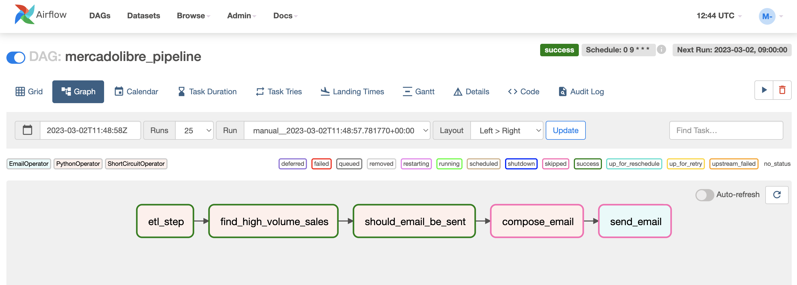
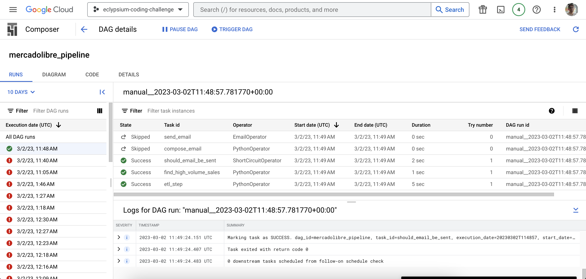
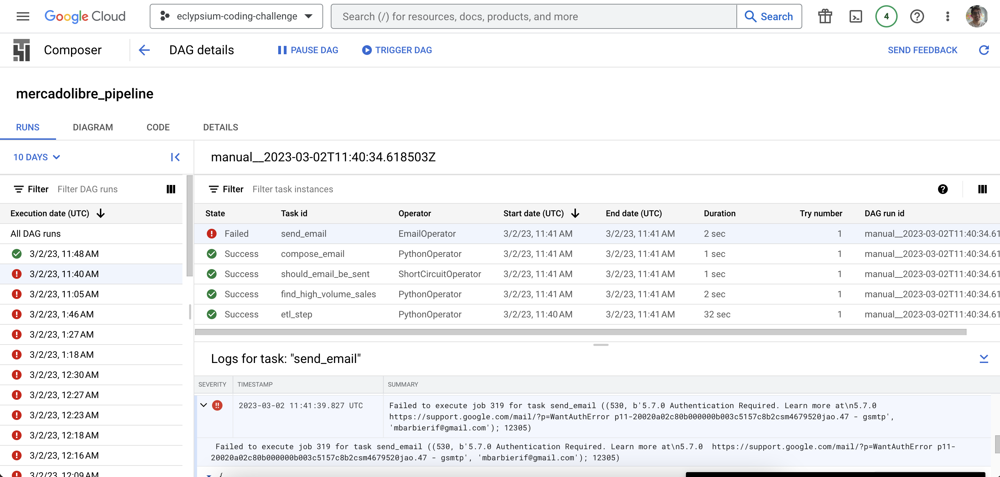
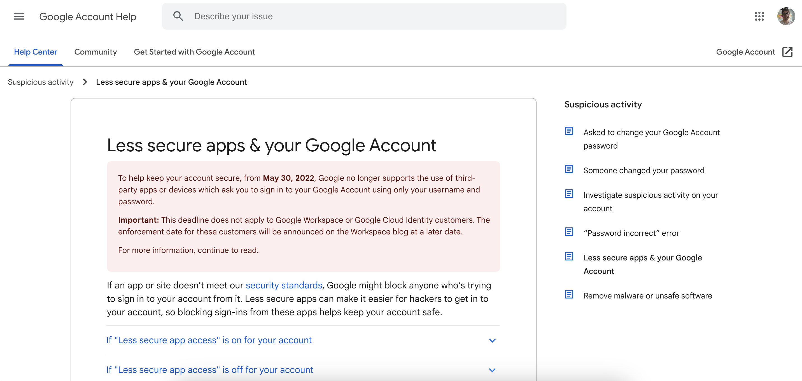
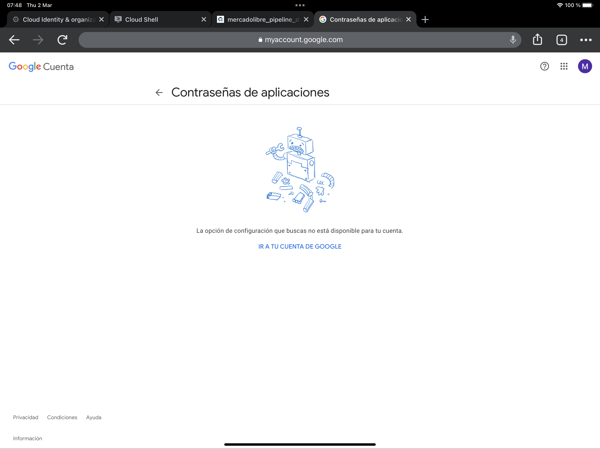
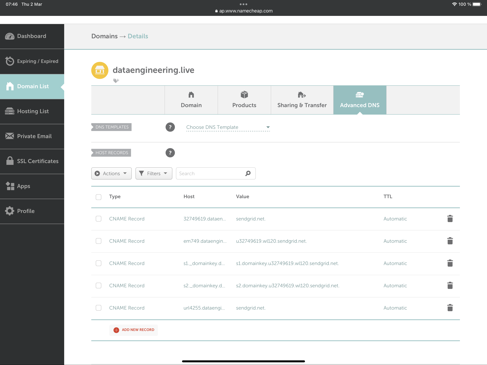

# Eclypsium Data Engineering Challenge

These are notes documenting my experience with this challenge, I want to explain all the design choices I made and the problems I bumped into while trying to write the Airflow DAG.

## I. Stack and Design

For Airflow, a local development environment with Docker seemed too complicated to set up, there are always little errors that would have take too much time to fix, so I decided to go full cloud for the challenge. Here's the initial stack idea I had using Google Cloud Platform.

As you can see, the data would be extracted from the MercadoLibre API, processed by Airflow inside the Cloud Composer environment, the transformation and load steps would be supported by the use of Cloud Storage, the data would be loaded to the internal PostgreSQL instance that came with the environment and then queried by Airflow again in order to compose the email notifications and send them.

Some of the main issues I found were with the internal database of the environment, and that Airflow couldn't access its mapped directories to the storage bucket, additionally, the biggest issue was the SMTP configuration inside Composer, I will detail that one afterwards. In reality, the design ended up looking more like this:

I couldn't use the Cloud Storage at all from Composer, or its internal DB, so as a workaround I created a managed Cloud SQL DB to operate.

## II. Airflow DAG

The final code for the Airflow DAG can be found here: [https://github.com/mbarbierif/eclypsium-etl/blob/main/mercadolibre_pipeline_dag.py](https://github.com/mbarbierif/eclypsium-etl/blob/main/mercadolibre_pipeline_dag.py).

The DAG is structured as follows:

### ETL Step

Initially, I tried to use Airflow internal operators such as `PostgresOperator` to connect to the DB, but I had issues accessing the SQL or CSV files I wanted to ingest, so I decided to create this initial task that performed all that was needed for the first part of the challenge. You can check the code to see the details of implementation but basically:

* 1. Uses `requests` to extract the data from the API.
* 2. Wrangles the data and creates a `pandas` DataFrame.
* 3. Establishes a connection to PostgreSQL using `SQLAlchemy` and loads the data.

### Find High Volume Sales

Here, some of the steps from the ETL part are repeated to ensure idempotency. This step basically queries the DB to find the sales over ARS$7.000.000 and its return is crucial for the rest of the operation.

* If there are no rows returned from the query => returns `None`
* If there are rows => returns the product list as JSON

Both of these cases end up stored in the DAG XComs.

### Should Email be sent?

This is a ShortCircuit Operator, meaning that if it returns `False` none of the other tasks will be performed. This is the most important logical step in the pipeline. It accesses the result of the previous task through the XCom to decide.

* If the previous task returned `None` => returns `False`, and the pipeline stops here
* In any other case => returns `True`, and the process continues, triggering the email logic

### Compose Email & Send Email

I tried to avoid writing this extra task to write the `html_content` of the `EmailOperator`, but a single function that was not used as a Python callable didn't have the possibility to access the context and get important information from the XComs, that's why I needed to explicitly define a task for this. I wanted to send a designer template for the email to make it look more professional, but the HTML code was too long to be sent through an XCom, so I just defined a very short HTML template manually.

The `compose_email` task will render an HTML Jinja Template with the data that we need to send in the email, then `send_email` is an `EmailOperator` that uses the rendered template to send the information.

## DAG Runs

You can see here that the ShortCircuit works perfectly, in order to achieve this I changed the SQL Query so `price * sold_quantity < -100` instead of `>= 7000000` and that triggered the empty product list we needed to test this case:

When we do need to send the email, the `compose_email` task works without problem, but it can't be sent because Airflow is not authorized to use my Gmail account, the problem lies in the SMTP configuration:

## III. SMTP Configuration Issues

At first, I didn't understand why Airflow wasn't sending the email, but then I realized it's using an Email Backend to perform this task. I arrived at this point just last night, so I followed the official documentation to learn I was supposed to use SendGrid as the default email provider: [https://cloud.google.com/composer/docs/composer-2/configure-email](https://cloud.google.com/composer/docs/composer-2/configure-email)

The issue is that SendGrid doesn't let you create a "Sender Identity" without a validated domain, and that's needed to get any sort of API Key for their service. Looking for alternatives, I decided to just try to use my own Gmail account, changing multiple environment variables for Cloud Composer, only to learn that they're not supporting App Passwords anymore:

I even tried with a different account that didn't have 2-step verification actived yet:

At that point I decided to just buy a domain to continue trying with SendGrid (`dataengineering.live`), however, SendGrid asked me to configure advanced DNS settings to set up my domain with their service, adding CNAME records. The issue is that, as you know, these DNS changes will take hours to propagate, it could even take 72 hours:

I checked this morning, and the DNS records still didn't propagate overnight, so I decided to stop here to write the documentation for the project. Will check again in a couple of days to see if I can configure the SMTP correctly and see an email in my inbox.

## Closing Remarks

I want to thank you for this opportunity, I learned a lot with this challenge and I only wish I had a little more time before I turn this in so I can complete the SMTP configuration and have a fully functional DAG. I hope this document and the code's comments explain the most important implementation details, but you can always email me if you have any questions (mbarbierif@gmail.com), I'll be more than happy to answer. Again, thank you for considering me for this position, I'll be waiting for news, have a great rest of the week!

---

Mauricio Barbieri  
*Sr. Data Engineer & Python Developer*  
mbarbierif@gmail.com  
+54 221 6552307
